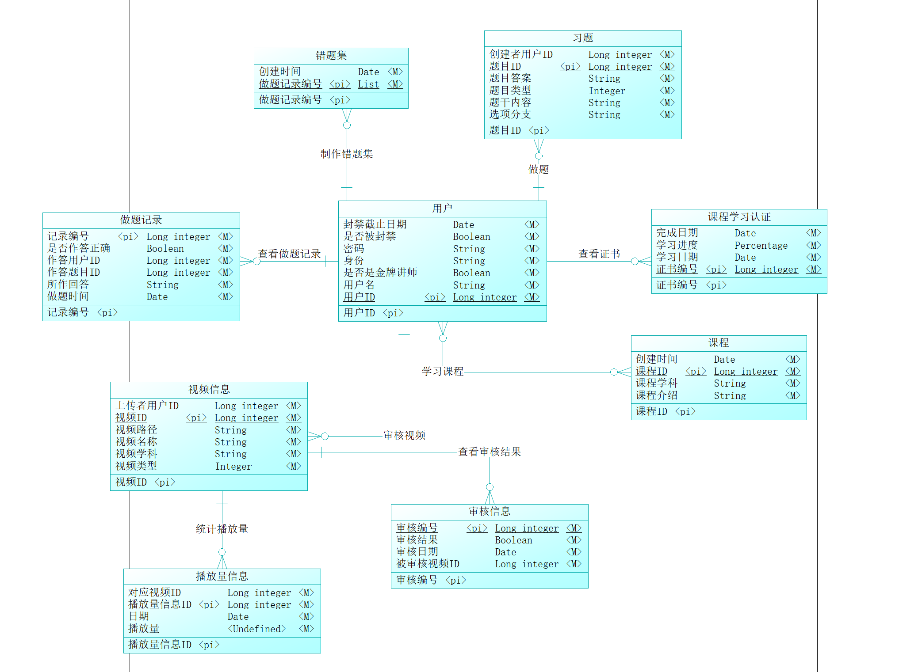
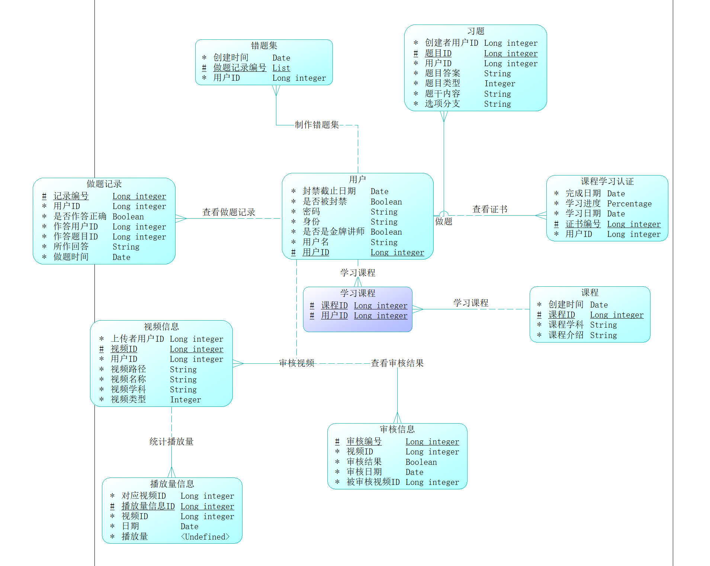
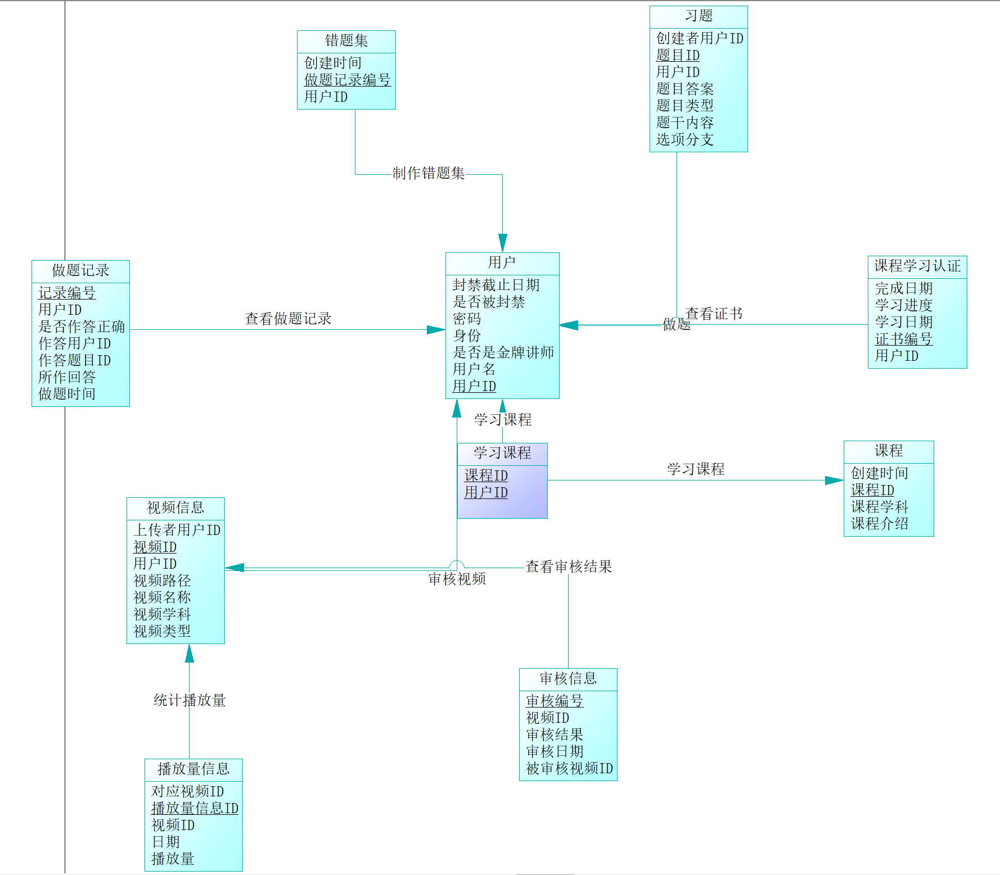

# CDM图

设计思路：本系统的主要使用人员是用户。用户可以进行以下行为（括号里主要说明了多重性）：制作错题集（一个用户可以制作多个错题集），做题（一个用户可以做很多题），查看证书（一个用户可以查看很多证书），学习课程（一个用户可以学习很多课程），审核视频（首先用户得是管理员，用户的身份尤其属性中的“身份”决定。一个管理员可以审核很多视频），查看做题记录（一个用户可以有很多做题记录）。在查看视频信息的时候，还可以查看视频的审核信息，和播放量，一个视频可以被多次审核和记录播放量。其它的实体中拥有的主要属性是：本实体的ID，本实体的一些内容，以及其他状态之类的属性。

# LDM图

# PDM图

